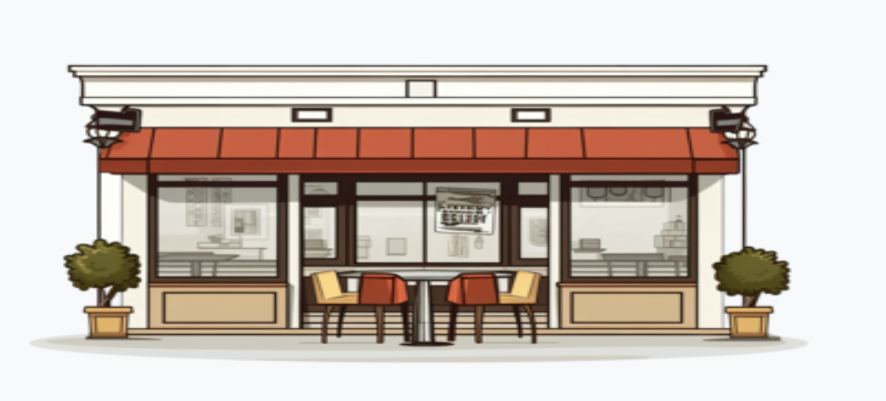
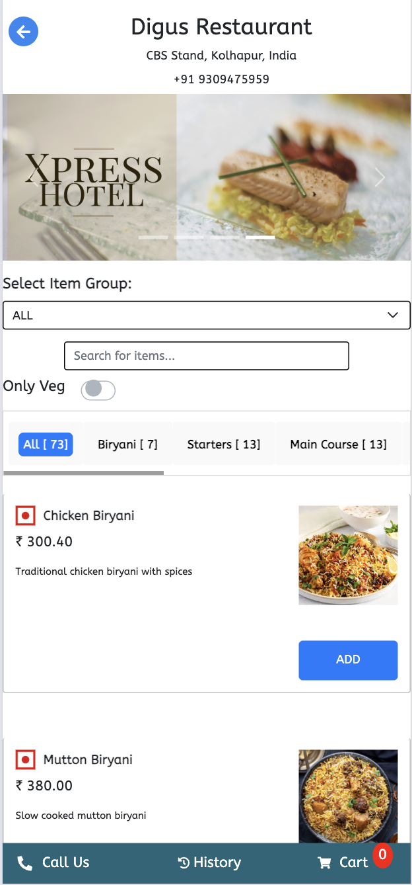
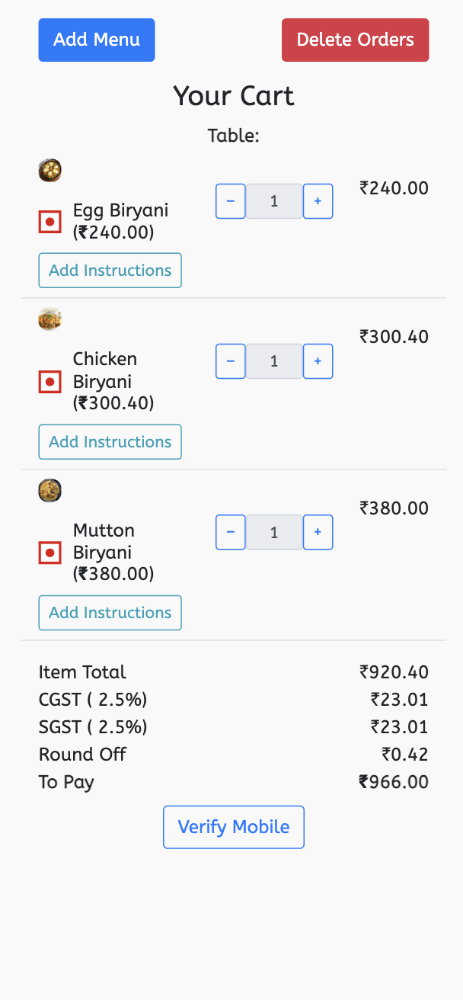
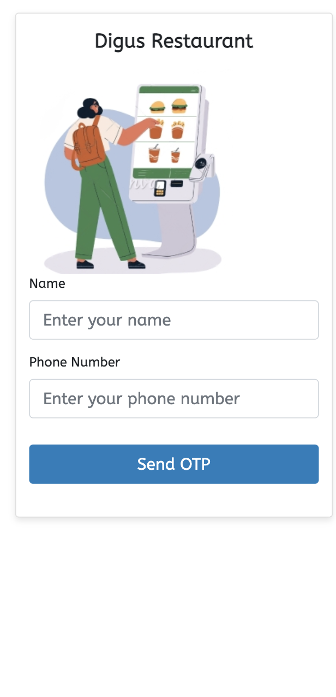
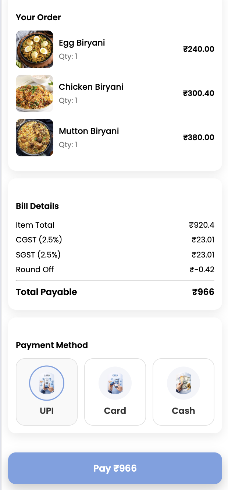
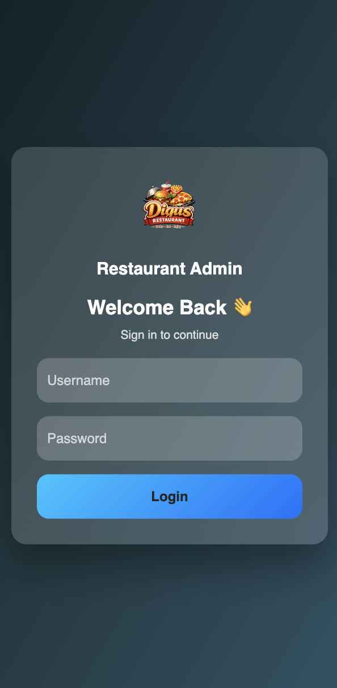
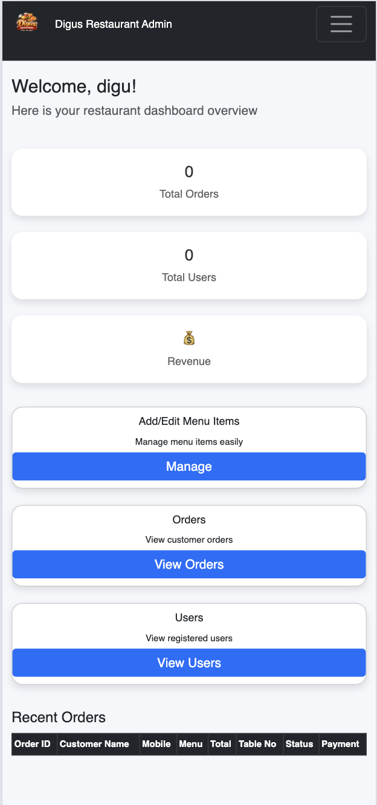

<p align="center">
  
</p>

<h1 align="center">🍔 Online Food Ordering System</h1>

<p align="center">
  A responsive web-based food ordering platform built using <b>PHP & MySQL</b>
</p>

---

## 📌 Description
An **Online Food Ordering Website** where users can browse, order, and manage food items seamlessly.

- Integrated **RESTful APIs** to fetch real-time food data such as price and availability  
- Responsive UI designed using **HTML, CSS, JavaScript, and Bootstrap**  
- Secure backend using **PHP sessions, user authentication, and order processing**

---

## ✨ Features
✔ User Authentication  
✔ Admin Dashboard  
✔ Food Menu Management  
✔ Cart & Order Management  
✔ Payment Status Tracking  

---

## 🛠️ Technologies Used

| Technology | Purpose |
|-----------|---------|
| PHP | Backend Logic |
| MySQL | Database |
| HTML | Page Structure |
| CSS | Styling |
| JavaScript | Client-side Logic |
| Bootstrap | Responsive Design |

---

## 📸 Project Screenshots

### 🏠 Home Page


### 🛒 Cart Page


### 📱 Mobile Verification


### 💳 Payment Page


### 🔐 Admin Login


### 🧑‍💼 Admin Dashboard


---

## 🚀 How to Run the Project

1. Clone the repository  
   ```bash
   git clone https://github.com/your-username/online-food-ordering.git

2. Move the project folder to htdocs

   C:\xampp\htdocs\

3. Start XAMPP

4. Import the database

   4.1 Open phpMyAdmin
   4.2 Create a database (e.g. online_food)
   4.3 Import the provided .sql file

5. Open the project in your browser

   http://localhost:8080/online_food/splash.php?parameter=diguu


👨‍💻 Author

Digvijay Vapilkar
